# Character Creator — Project Documentation

This document is the canonical architectural reference for the **Character Creator** project built in Godot 4. It covers the core systems, the character creation pipeline, and the data/settings architecture.

---

## 1. Project Structure

```
character-creator/
├── core/                        ← Reusable, domain-agnostic systems
│   ├── systems/
│   │   ├── reactive_system/     ← Reactive data wrappers + signals
│   │   └── state_machine/       ← Node-based FSM
│   ├── assets/
│   ├── components/
│   └── globals/
│
└── character_creator/           ← Domain-specific character creator
    ├── assets/
    │   ├── material/
    │   ├── textures/
    │   └── placeholder/
    ├── components/
    │   └── character_creation/
    │       ├── base/            ← Manager, UI, updater orchestration
    │       └── visual_updaters/ ← Per-feature visual logic
    ├── data/
    │   ├── settings/            ← CharacterSetting subclasses
    │   ├── options/             ← SelectOption subclasses
    │   ├── character_data.gd
    │   └── character_creation_settings.gd
    └── scenes/
        ├── camera/
        └── character/
```

---

## 2. Core Systems (`core/`)

### 2.1 Reactive System

The backbone of all data flow in this project. Variables are wrapped in `Reactive` subclasses that emit a `reactive_changed` signal whenever their value changes.

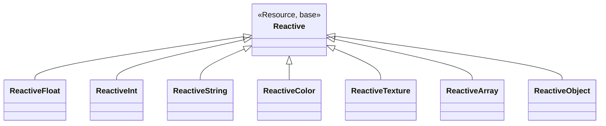

**Propagation chain:** A `Reactive` can have an `owner` (another `Reactive`). When a nested reactive changes, the signal bubbles up through `_propagate()` — e.g., changing `CharacterData.eyes_size.value` also fires `CharacterData.reactive_changed`.

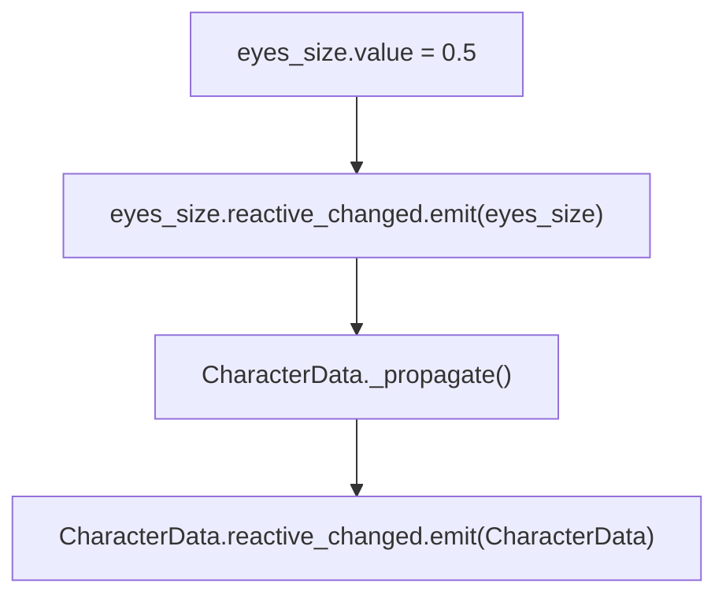

### 2.2 State Machine

Node-based FSM with `StateMachine`, `State`, and `Transition` nodes. Each `State` has `enter()`, `update()`, `physics_update()`, `exit()` lifecycle hooks.

---

## 3. Character Creator Architecture

### 3.1 High-Level Overview

The character creator is built around a **single source of truth** principle: `CharacterData` is the only authoritative representation of a character's state. Everything else either reads from it or writes to it.

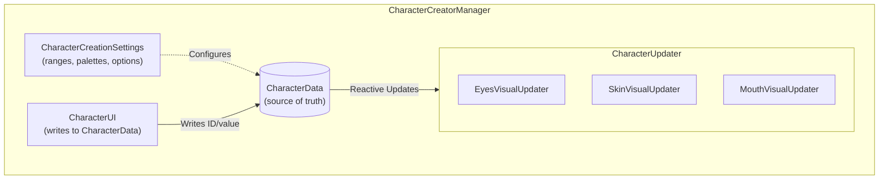

### 3.2 Node Hierarchy

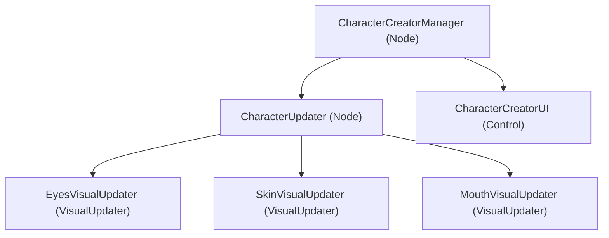

### 3.3 Initialization Sequence

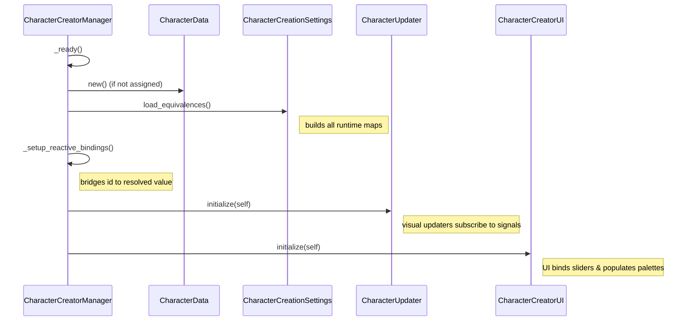

---

## 4. Data Layer

### 4.1 CharacterData

The serializable snapshot of a character. Contains two types of fields per select parameter:

| Field | Type | Purpose |
|---|---|---|
| `eye_texture_id` | `ReactiveString` | Persistence key — saved to disk, order-independent |
| `eye_texture` | `ReactiveTexture` | Runtime-resolved texture — what visual updaters read |
| `skin_color_id` | `ReactiveString` | Persistence key |
| `skin_color` | `ReactiveColor` | Runtime-resolved color |
| `eyes_size` | `ReactiveFloat` | Direct float value (no ID needed for ranges) |
| `eyes_separation` | `ReactiveFloat` | — |
| `eyes_rotation` | `ReactiveFloat` | — |
| `eyes_height` | `ReactiveFloat` | — |

> **Why two fields for select params?**
> Storing the ID (`"eye_almond"`) makes saves portable: adding, removing, or reordering palette options never breaks existing character data. The resolved runtime value is set by `CharacterCreatorManager` — visual updaters never look up settings themselves.

**To reproduce any character:** pass a `CharacterData` to `CharacterUpdater.load_character_data()`. Each `VisualUpdater` reads the current values and applies them immediately.

```gdscript
character_updater.load_character_data(saved_data)
```

### 4.2 ID → Runtime Value Resolution (Manager Bridge)

`CharacterCreatorManager` is the **only** class that knows both `CharacterData` and `CharacterCreationSettings`. It bridges select IDs to resolved values:

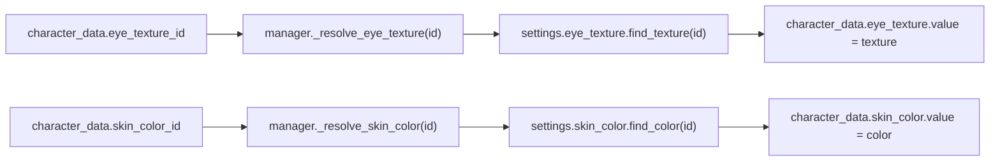

---

## 5. Settings Architecture

### 5.1 Class Hierarchy

All settings are `Resource` subclasses, editable in the Godot inspector, and saved as `.tres` files.

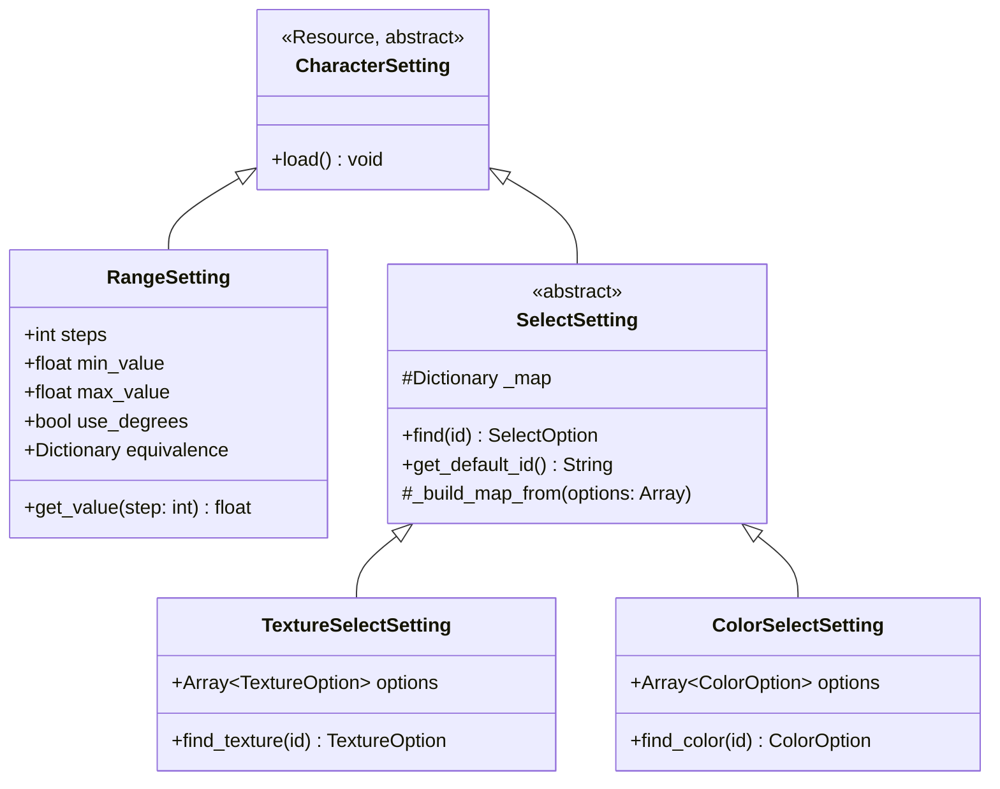

### 5.2 Option Types

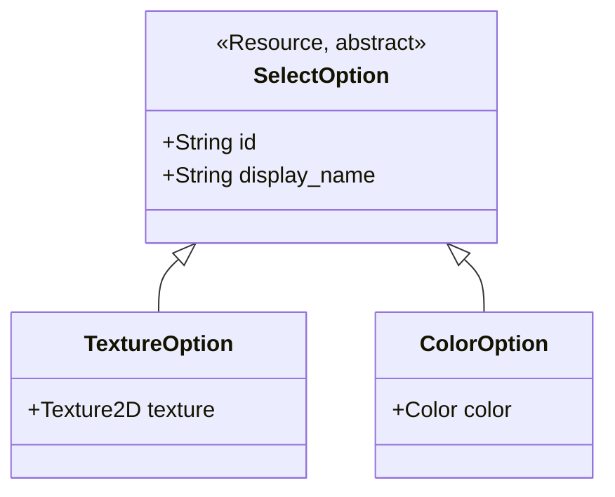

> **ID convention:** `snake_case` strings, e.g. `"eye_almond"`, `"skin_pale"`. **Never change an ID** after `.tres` files are created — it is the key used to restore a character's saved data.

### 5.3 CharacterCreationSettings

After the refactor, this class is purely declarative:

```gdscript
class_name CharacterCreationSettings
extends Resource

@export var eyes_separation : RangeSetting
@export var eyes_size       : RangeSetting
@export var eyes_rotation   : RangeSetting   # use_degrees = true in .tres
@export var eyes_height     : RangeSetting
@export var eye_texture     : TextureSelectSetting
@export var skin_color      : ColorSelectSetting

func load_equivalences() -> void:
    eyes_separation.load(); eyes_size.load(); ...
```

**Adding a new range parameter** takes exactly 2 lines (1 export + 1 `load()` call). **Adding a new palette option** requires only creating a new `.tres` file and adding it to the setting's array in the inspector.

### 5.4 Lookup Performance

All select settings use a pre-built `Dictionary[String, SelectOption]` for **O(1)** lookup by ID. The map is built once during `load_equivalences()` at startup.

```
find_texture("eye_almond")
  → _map.get("eye_almond", null)   ← O(1)
```

---

## 6. Visual Updater System

### 6.1 Base Contract

```
VisualUpdater  (Node, abstract)
├── initialize(manager: CharacterCreatorManager) [abstract]
│     Connect reactive signals for real-time updates during a creator session.
└── load_character_data(data: CharacterData) [abstract]
      Apply all current values from CharacterData immediately.
      Used to reproduce any saved character without a full manager session.
```

### 6.2 Updater Lifecycle

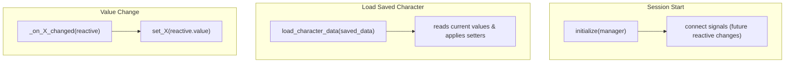

### 6.3 EyesVisualUpdater Responsibility Map

| Signal source | Handler | Setter |
|---|---|---|
| `eyes_size.reactive_changed` | `_on_eyes_size_changed` | `set_eyes_size(value)` |
| `eyes_separation.reactive_changed` | `_on_eyes_separation_changed` | `set_eyes_separation(value)` |
| `eyes_rotation.reactive_changed` | `_on_eyes_rotation_changed` | `set_eyes_rotation(value)` |
| `eyes_height.reactive_changed` | `_on_eyes_height_changed` | `set_eyes_height(value)` |
| `eye_texture.reactive_changed` | `_on_eye_texture_changed` | `set_eye_texture(texture)` |

> `_initial_eyes_height` is captured in `_ready()` (not `initialize()`) so that `load_character_data()` produces correct results even when called independently of a manager session.

---

## 7. UI System

`CharacterCreatorUI` is a passive view: it only **writes** to `CharacterData`. It never reads from it for display (that is the visual updater's job).

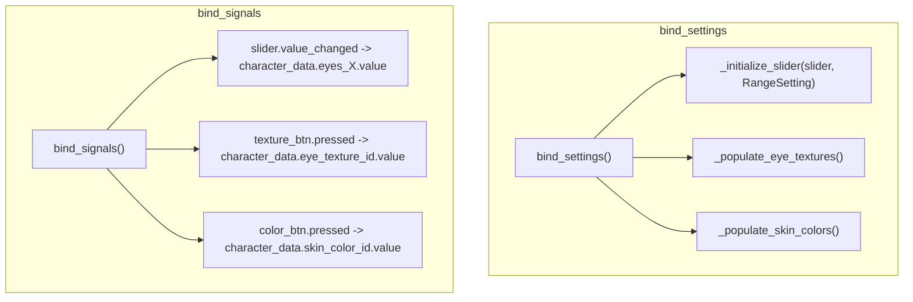

---

## 8. Full Data Flow — User Selects an Eye Texture

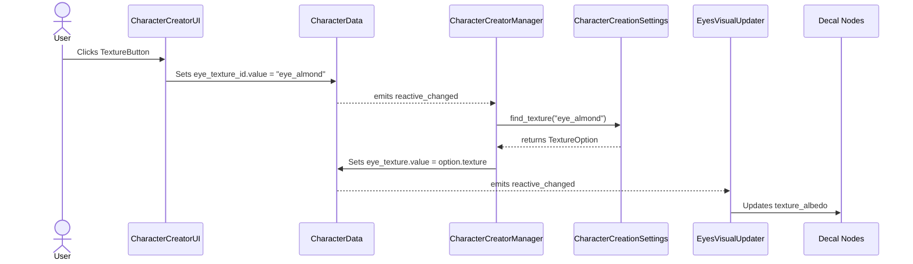

---

## 9. Setup Checklist (Editor)

When setting up the project in the Godot editor:

### `creation_settings.tres`
- Assign a `RangeSetting.tres` for each eyes parameter (`eyes_separation`, `eyes_size`, `eyes_rotation`, `eyes_height`)
- For `eyes_rotation`: set `use_degrees = true`, `min_value = -45`, `max_value = 45`
- Assign a `TextureSelectSetting.tres` for `eye_texture`
- Assign a `ColorSelectSetting.tres` for `skin_color`

### Option `.tres` Files
- Create one `TextureOption.tres` per eye texture option — set `id` (snake_case, permanent), `display_name`, `texture`
- Create one `ColorOption.tres` per skin color — set `id`, `display_name`, `color`
- Add all options to the respective setting's `options` array

### Scene Setup
- Assign `l_eye_decal` and `r_eye_decal` exports in `EyesVisualUpdater`
- Assign a `Container` node to `eye_texture_container` in `CharacterCreatorUI`
- Assign a `Container` node to `skin_color_container` in `CharacterCreatorUI`

---

## 10. Workflow: Adding a New Property

Use the following decision tree to understand the steps required when adding a new character property to the system.

```mermaid
flowchart TD
    Start([Want to add a new property?]) --> Type{Is it a continuous Range<br>or a discrete Selection?}

    %% Range Branch
    Type -->|Range<br>(e.g., Size, Position)| R1["1. CharacterData<br>Add 'ReactiveFloat' variable"]
    R1 --> R2["2. CharacterCreationSettings<br>Add '@export var prop: RangeSetting'<br>Call 'prop.load()' in load_equivalences()"]
    R2 --> R3["3. CharacterCreatorUI<br>Bind a new UI slider to the data"]
    R3 --> R4["4. VisualUpdater<br>Listen to 'reactive_changed' and<br>apply visual changes"]

    %% Select Branch
    Type -->|Selection<br>(e.g., Texture, Color)| S1["1. CharacterData<br>Add 'ReactiveString' for ID<br>Add 'Reactive[Type]' for resolved value"]
    S1 --> S2["2. CharacterCreationSettings<br>Add '@export var prop: SelectSetting'"]
    S2 --> S3["3. CharacterCreatorManager<br>Connect ID change signal to resolve<br>and update the resolved value"]
    S3 --> S4["4. CharacterCreatorUI<br>Populate UI buttons from Setting options<br>Write selected ID to CharacterData"]
    S4 --> S5["5. VisualUpdater<br>Listen to resolved value 'reactive_changed'<br>and apply visual changes"]
    
    %% Editor Setup
    R4 --> E1([Done! Now create and assign<br>.tres resources in the Editor])
    S5 --> E1
```

---

*Generated by Antigravity AI — Last updated 2026-04-28*
